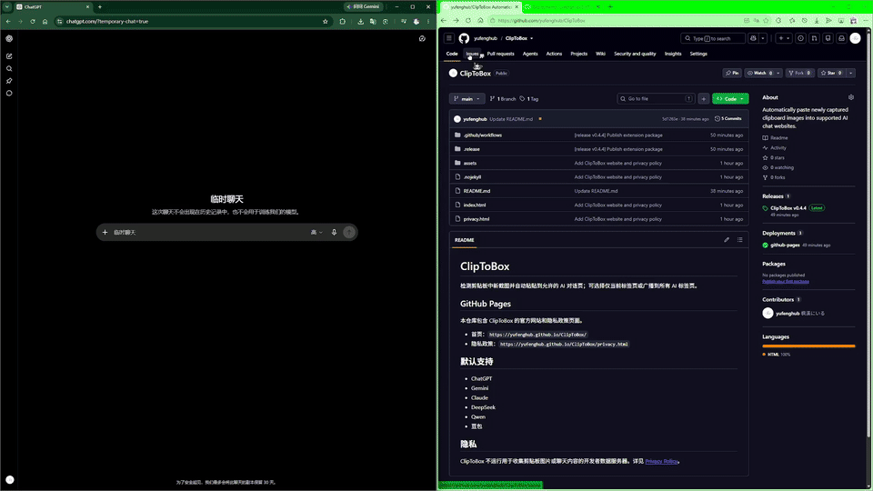

# ClipToBox

检测剪贴板中新截图并自动粘贴到允许的 AI 对话页；可选择仅当前标签页或广播到所有 AI 标签页。

Detects new screenshots in the clipboard and automatically pastes them into supported AI chat pages; options include pasting only into the current tab or broadcasting to all AI tabs.

## 演示

## GitHub Pages

本仓库包含 ClipToBox 的网站和隐私政策页面。

- 首页：`https://yufenghub.github.io/ClipToBox/`
- 隐私政策：`https://yufenghub.github.io/ClipToBox/privacy.html`

## 默认支持

- ChatGPT
- Gemini
- Claude
- DeepSeek
- Qwen
- 豆包

## 隐私

ClipToBox 不运行用于收集剪贴板图片或聊天内容的开发者数据服务器。详见 [Privacy Policy](privacy.html)。
